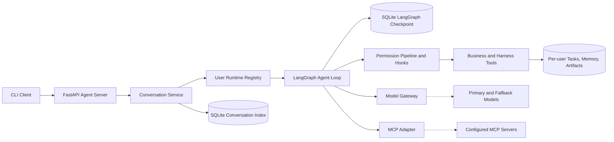

# Business Agent Harness

> 面向业务 Agent 应用的能力复用与运行框架。

Business Agent Harness 是一个基于 Python、LangGraph 和 LangChain 构建的 Agent Harness，面向不同业务场景提供可复用的智能体能力装配与运行机制。项目将 Agent Loop、工具调用、权限控制、上下文与记忆管理、任务编排和运行状态管理等共性能力从业务逻辑中抽离，支持业务 Agent 按“单 Agent 基础能力 → 知识检索增强 → 多 Agent 协作”逐步演进。当前以 `Knowledge Assistant` 作为参考应用，验证文件分析、报告生成和任务管理等典型业务闭环。

当前状态：**第一阶段 M1-M5 已完成；RAG、Agent Teams 和生产化能力处于后续规划阶段。**

详细实施路线请参阅：[通用 Agent 项目架构与实现计划](./plan/implementation-plan.md)

## 第一阶段项目亮点

第一阶段围绕通用 Agent Harness，完成从请求接入、上下文构建、模型决策、权限控制、工具执行到状态恢复的单 Agent 闭环，并通过 `Knowledge Assistant` 完成集成验证。

- **完整且可复用的 Agent Harness**：基于 LangGraph 统一封装 Agent Loop、Tool Use、Permission、Hooks、Context、Memory 和 Task 等通用能力；通过 `AgentProfile` 与标准化 `Message`、`ToolUse`、`ToolResult`、`AgentState` 契约实现业务解耦，支持 `Prepare → Context → Model → Permission → Tool → Model / Final` 执行闭环。
- **多用户与多会话隔离**：FastAPI Agent Server 支持多个可信本地用户，为用户懒加载并复用独立的 User Runtime 和 AgentLoop；隔离 Workspace、Knowledge、Skill、Memory、Task、Checkpoint 和 Artifact，不同 Conversation 可并发执行且同一 Conversation 同时只允许一个活跃 Run。
- **长会话上下文与 Memory 治理**：通过优先级、去重和字符预算控制上下文，使用 Context Compact 压缩长会话；超大 ToolResult 外置为 Artifact，Skill 按需加载，Memory 支持用户级跨会话持久化与按需注入。
- **模型网关与可靠性治理**：`ModelGateway` 统一处理跨进程并发额度、超时/限流/连接错误/5xx 重试、指数退避、`Retry-After` 和备用模型降级，并通过带有 `thread_id`、`run_id` 的事件与日志记录重试、降级和最终失败。
- **Task System 与 MCP 工具扩展**：Task 支持创建、认领、依赖、完成和失败管理，SQLite WAL 与 `BEGIN IMMEDIATE` 保证并发认领的一致性；MCP 工具转换为统一 Tool 契约，支持多种传输方式、权限判断和 Server 级故障隔离。
- **Knowledge Assistant 业务闭环验证**：以文件分析为场景，串联 TodoWrite、Task System、受限文件读取、安全计算、报告生成与审批、任务结果保存，验证通用 Harness 在具体业务中的装配与复用能力。


## 系统架构

### 总体架构



### 核心分层

```text
src/
├── harness/                         # 通用 Agent Harness
│   ├── agent_loop.py                # AgentLoop 对外门面
│   ├── graph.py                     # LangGraph 节点和路由
│   ├── messages.py                  # 消息和 Tool 契约
│   ├── permissions.py               # Permission Pipeline
│   ├── tool_use.py                  # Tool 注册和执行
│   ├── conversation.py              # Conversation 和 Run 生命周期
│   └── capabilities/                # Todo、Skill、Memory、Compact、Task 等
├── business/
│   └── knowledge_assistant/         # 当前业务 Agent
│       ├── profile.py               # 业务能力装配
│       ├── permission_rules.py      # 业务权限规则
│       ├── tools/                   # Calculator、File Reader、Report Writer
│       ├── skills/                  # 内置 Skill
│       └── agent_teams/             # 后续 Agent Teams 预留目录
├── services/                        # 模型、存储、MCP、日志等实现
└── entrypoints/                     # CLI、API、Bootstrap 等入口

tests/
├── unit/                            # 单元测试
└── integration/                    # API、Checkpoint 和业务闭环测试
```

### 运行时职责

- `ConversationService` 管理会话所有权、Run 状态、并发控制和权限恢复。
- `UserRuntimeRegistry` 按用户创建并缓存 Runtime，绑定用户级目录和 Store。
- `AgentLoop` 负责模型、权限、工具和终止路由，不直接处理具体业务。
- `ModelGateway` 是共享的模型调用入口，负责重试、并发和降级。
- `Tool and Capability Layer` 执行本地工具、Task、Memory、Skill 和 MCP 工具。
- SQLite Checkpoint 保存 Graph 状态；用户级 Store 保存 Task、Memory 和 Artifact。

### 持久化目录

```text
.agent/conversations.sqlite3       # 会话索引
users/<user_id>/
├── workspace/                     # 用户工作文件
├── knowledge/                     # 用户私有知识
├── skills/                        # 用户私有 Skill
├── memory/                        # 用户跨会话 Memory
├── checkpoints.sqlite3            # 用户 Checkpoint
└── tasks.sqlite3                 # 用户 Task
artifacts/<user_id>/               # 用户生成的报告和文件产物
```

## 快速启动

### 环境要求

- Python 3.12
- `uv`
- 一个已配置的模型 Provider

### 安装依赖

```bash
uv sync
cp .env.example .env
```

编辑 `.env`，至少配置：

```dotenv
AGENT_MODEL__PROVIDER=anthropic
AGENT_MODEL__MODEL_ID=your-model-id
AGENT_MODEL__API_KEY=your-api-key
```

### 启动 Agent Server

终端一：

```bash
uv run agent serve
```

默认监听 `127.0.0.1:8000`。也可以指定地址和端口：

```bash
uv run agent serve --host 127.0.0.1 --port 8000
```

### 启动 CLI

终端二：

```bash
uv run agent chat --user alice
```

CLI 内置命令：

```text
/new                         新建 Conversation
/list                        查看 Conversation
/switch <ID>                 切换 Conversation
/delete <ID>                 删除 Conversation
/cancel <ID>                 取消运行中的 Run
/usage                       查看 Token 用量
/skills                      查看可用 Skill
/mcp                         查看 MCP Server 和工具
/test tool|skill|mcp ...     强制测试指定能力
/exit                        退出
```

### 添加 Skill

内置 Skill 放在：

```text
src/business/knowledge_assistant/skills/<skill-name>/SKILL.md
```

用户私有 Skill 放在：

```text
users/<user_id>/skills/<skill-name>/SKILL.md
```

Skill 必须包含 `name`、`description` 和非空正文：

```markdown
---
name: data-analysis
description: Analyze data and explain evidence behind conclusions.
---

# Data Analysis

1. Inspect only authorized materials.
2. Separate facts from assumptions.
3. Explain the calculation and conclusion.
```

新增 Skill 后需要重启 Agent Server，或重新创建对应用户 Runtime。可以使用以下命令检查：

```text
/skills
/test skill data-analysis 请使用这个 Skill 分析当前资料
```

### 配置 MCP

MCP 默认关闭。准备好本地或远程 MCP Server 后，在 `.env` 中配置。

本地 stdio MCP：

```dotenv
AGENT_MCP__ENABLED=true
AGENT_MCP__DISCOVERY_TIMEOUT_SECONDS=10
AGENT_MCP__SERVERS={"local_demo":{"transport":"stdio","command":"python","args":["/absolute/path/to/server.py"]}}
```

远程 MCP：

```dotenv
AGENT_MCP__ENABLED=true
AGENT_MCP__SERVERS={"remote_demo":{"transport":"streamable_http","url":"https://example.com/mcp","headers":{"Authorization":"Bearer <token>"}}}
```

MCP 工具会在 Agent Server 初始化时发现一次，之后通过 `/mcp` 或 CLI 的 `/mcp` 查看结果。修改配置后需要重启 Server。

### 测试与质量检查

```bash
uv run pytest -q
uv run pytest --cov=src --cov-report=term-missing -q
uv run ruff check .
uv run pyright
```

截至 2026-08-27，当前环境验证结果为：

- `170 passed, 1 skipped`；
- 跳过项是需要真实模型配置的 Live Model 测试；
- Ruff 检查通过；
- Pyright 检查通过；
- 总体测试覆盖率约 86%。

当前 API 面向本地可信用户，不等同于正式身份认证和生产级多租户系统。
